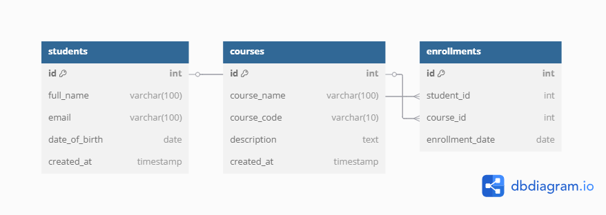

# 🎓 Student Portal System

A simple web-based Student Portal that allows users to manage student records including names, emails, and dates of birth. The system supports adding, viewing, editing, and deleting student information via a RESTful API backed by a MySQL database.

---

## 🚀 Features

- Add new students  
- View list of students  
- Edit student details  
- Delete student records  
- Responsive front-end built with HTML + JavaScript  
- RESTful API powered by Node.js + Express  
- MySQL database to store data  

---

## 🛠️ Setup Instructions

### 1. Clone the Repository

```bash
git clone https://github.com/marycathline/student-portal.git
cd student-portal

2. Install Dependencies
bash
npm install

3. Import the SQL schema:
Make sure you have MySQL installed and running. Then run
mysql -u your_mysql_username -p < answer.sql
Replace your_mysql_username with your own MySQL username when running the command. You’ll be prompted for your password.


4. Configure Environment Variables
Create a .env file in the root folder:
DB_HOST=localhost
DB_USER=your_mysql_username
DB_PASSWORD=your_mysql_password
DB_NAME=Student_Portaldb
PORT=3000


5. Run the Server
node server.js
Visit http://localhost:3000 in your browser to confirm the server is running.

6. Open the Frontend
Open index.html in your browser. It will interact with the backend API to display and manage student data.

🗃️ ERD (Entity Relationship Diagram)


👩‍💻 Author
Mary Cathline
Email: marycathln@gmail.com
